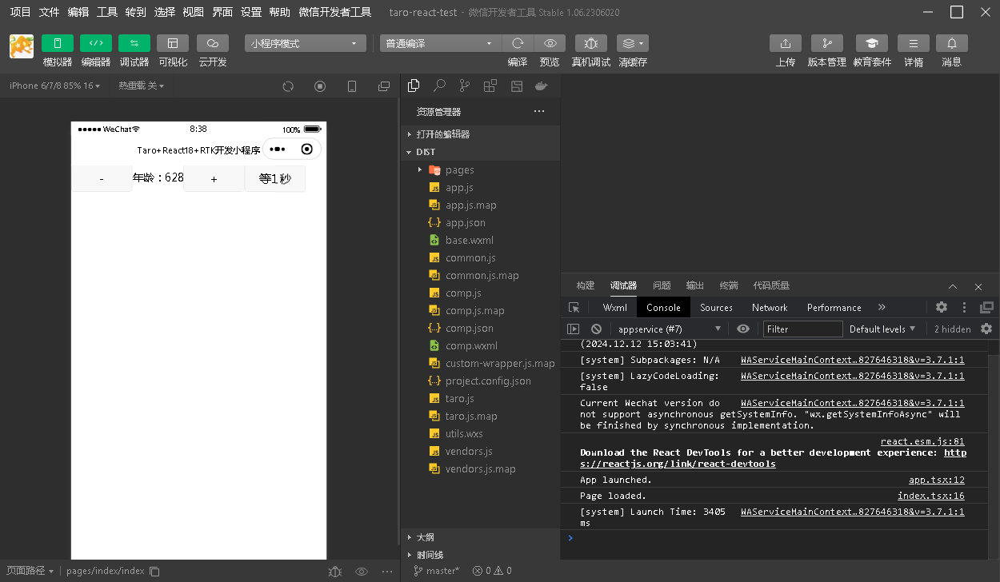

## 使用 Taro4 + React18 + @reduxjs/toolkit(RTK状态管理工具) 开发的简单微信小程序样例

- ### 全局安装基于 React 的适配多端平台的小程序开发工具脚手架 @tarojs/cli，Taro 是京东凹凸实验室团队开发，目前最新正式版为v4.0.8，支持使用 React/Vue 框架语言开发：

```sh
### yarn
yarn global add @tarojs/cli
### npm
npm i @tarojs/cli -g
```

- ### 初始化 taro 项目工程，按提示选择 react + ts 选项
```sh
taro init taro-react-test
```

- ### 安装 @reduxjs/toolkit(RTK状态管理工具) + react-redux 中间件
```ssh
cd taro-react-test
yarn add @reduxjs/toolkit react-redux
```

- ### 在项目根目录下的 project.config.json 配置文件中配置你的微信小程序的开发 appid，如下：
```json
{
  "miniprogramRoot": "./dist",
  "projectname": "taro-react-test",
  "description": "test project.",
  "appid": "wxexxxxxnnnnnnn",
  "setting": {
    "urlCheck": true,
    "es6": false,
    "enhance": false,
    "compileHotReLoad": false,
    "postcss": false,
    "minified": false
  },
  "compileType": "miniprogram"
}
```

- ### 然后到微信官网下载安装\<微信开发者工具\>

- ### 编写代码，执行 yarn dev:weapp 编译生成微信小程序源码在 dist 目录，用\<微信开发者工具\>打开导入该 dist 目录运行调试即可

- ### \<微信开发者工具\> 调试运行图

